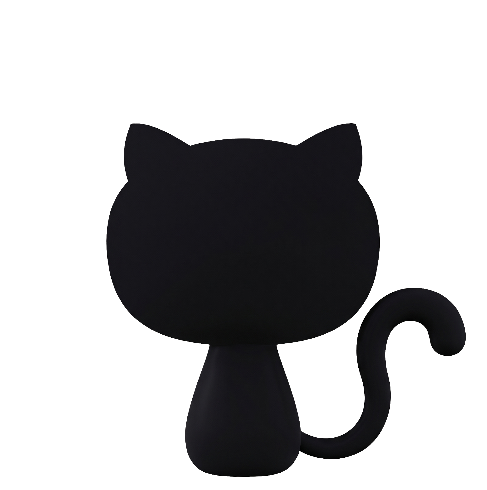
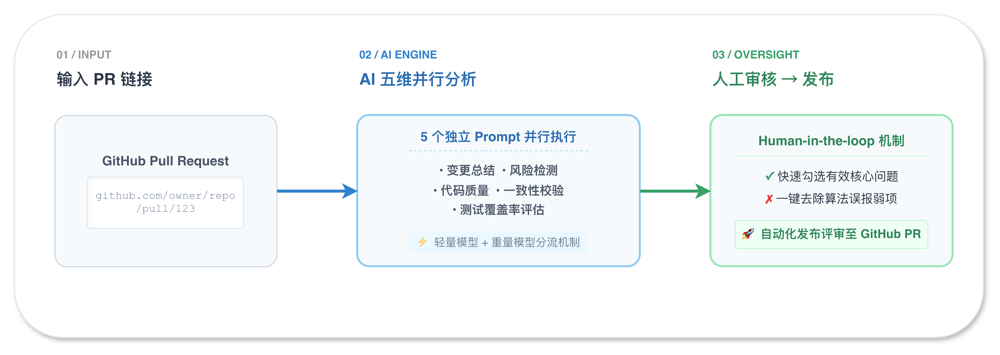
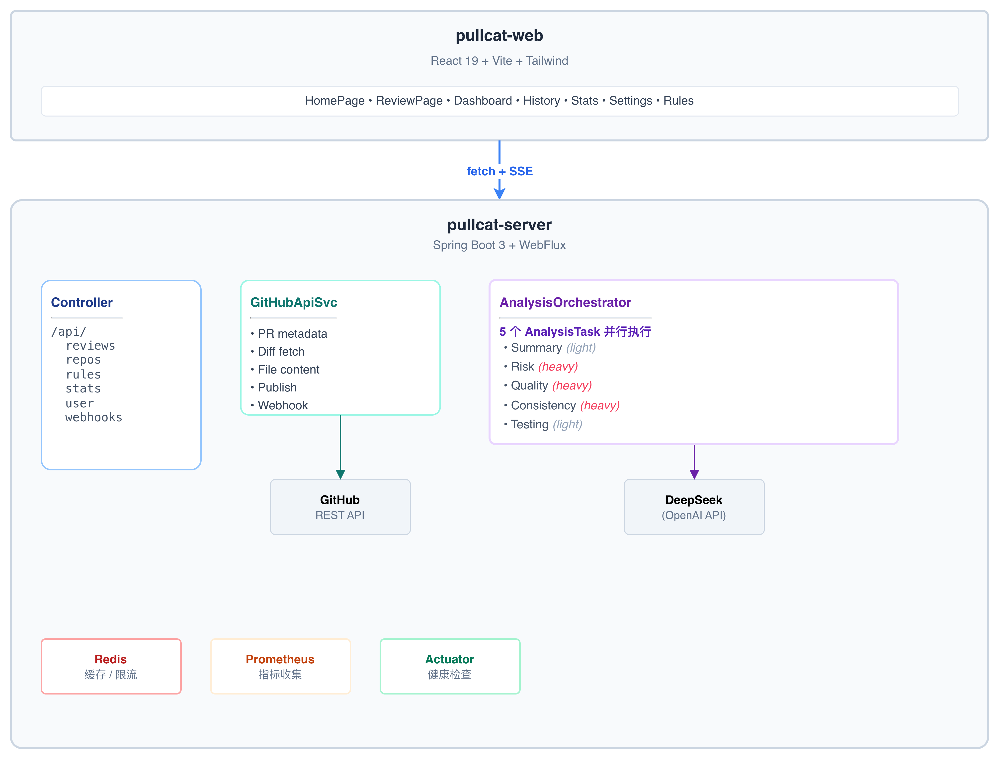

<p align="center">
  
</p>

<h1 align="center">Pullcat</h1>

<p align="center">
  <strong>AI 驱动的代码评审助手，让每次 Pull Request Review 都高效、全面、零遗漏。</strong>
</p>

<p align="center">
  <a href="https://xmon.me">
    
  </a>
</p>

<p align="center">
  
  
  
  
</p>

---

## 它是怎么工作的



每个分析维度使用独立的 Prompt，从不同视角审视同一批代码变更。摘要和测试覆盖使用轻量模型降低成本，风险/质量/一致性使用重量模型保证深度。

## Demo

<p align="center">
  <a href="#">
    
  </a>
</p>

> **在此处插入 Demo 视频链接或嵌入视频**

---

## 功能亮点

| 功能 | 说明 |
|------|------|
| 🔍 **五维分析** | 变更总结、风险检测、代码质量、一致性、测试覆盖——五个独立 Prompt 并行分析 |
| 🧠 **双模型策略** | 轻量/重量模型按需分流，平衡分析深度与成本 |
| 📡 **实时进度** | Server-Sent Events 流式推送，分析过程全程可见 |
| ✅ **人工审核** | AI 生成问题列表，用户勾选确认后发布，控制误报 |
| 📝 **Suggestion Diff** | 附带可应用的代码修复建议，发布为 GitHub suggestion block |
| 🔧 **自定义规则** | 仓库级别正则规则引擎，补充团队特定约定 |
| 💡 **AI 规则建议** | 从历史 Review 数据中自动提炼高频问题，生成规则建议 |
| 🔄 **对比审查** | 两次 Review 结果 Diff，追踪新增/修复/遗留问题 |
| 🪝 **Webhook 自动审查** | PR 打开或更新时自动触发分析 |
| 🔐 **OAuth 登录** | GitHub 登录后免配 Token，OAuth token 直接调用 API |
| 📊 **统计分析** | 仪表盘、历史记录、严重度分布图表 |
| 🌓 **深色模式** | Light / Dark 主题切换 |
| 🩺 **运维就绪** | Prometheus 指标、Health Check、请求限流、重试机制 |

### 原创功能部分
以下为核心原创设计，未直接依赖任何第三方库：
- 五维 Prompt 拆分 + 并行编排引擎                               
- 上下文构建器（Import 解析、依赖文件关联、Token 预算管理）        
- 跨维度去重合并算法（ResultAggregator）                          
- 自定义规则引擎（Regex + 多类型匹配）                            
- AI 规则建议（历史 Issue 聚合 + LLM 规则生成）                  
- SSE 流式进度推送 + StreamRegistry                              
- Diff 查看器（Git diff 解析 + 行级 Issue 标记 + 文件 Tab）      
- Suggestion Diff 生成与 GitHub suggestion block 发布       

---

## 技术栈与依赖

### 后端 (Spring Boot 3.3.5 / Java 17)

| 依赖 | 用途 | 类型 |
|------|------|:--:|
| Spring Boot Web | REST API + SSE 流式推送 | 框架 |
| Spring Boot WebFlux | GitHub API 响应式调用 (WebClient) | 框架 |
| Spring AI (OpenAI) | 对接 DeepSeek LLM，统一 ChatClient 接口 | SDK |
| Spring Boot Data Redis | 审查会话缓存、限流计数 | 基础设施 |
| Spring Boot OAuth2 Client | GitHub OAuth 登录 | 基础设施 |
| Spring Boot Actuator + Micrometer Prometheus | 健康检查、指标暴露 | 运维 |
| Meemaw `spring-dotenv` | `.env` 文件加载 | 工具 |
| Lombok | 减少样板代码 | 工具 |

### 前端 (React 19 / Vite 8 / TypeScript 6)

| 依赖 | 版本 | 用途 |
|------|------|------|
| React + ReactDOM | ^19 | UI 框架 |
| React Router | ^7 | 客户端路由 |
| Tailwind CSS | ^4 | 原子化 CSS，深色模式 |
| Recharts | ^3 | 严重度饼图、问题类型柱状图 |
| react-markdown + remark-gfm | ^10 / ^4 | LLM 输出的 Markdown 渲染 |
| Radix UI (Dialog/Dropdown/Tooltip) | ^1-^2 | 无样式无障碍基础组件 |
| Sonner | ^2 | Toast 通知 |

### AI 服务

| 服务 | 模型 | 用途 |
|------|------|------|
| DeepSeek | deepseek-chat / deepseek-reasoner | 五维分析 |

---

## 系统架构


---

## 快速开始

### 环境要求

- **Java 17+** / **Node.js 20+** / **Redis** / **DeepSeek API Key**

### 1. 克隆并配置

```bash
git clone https://github.com/xiechimon/pullcat.git && cd pullcat
cp .env.example .env
# 编辑 .env，填入 DEEPSEEK_API_KEY
# GitHub OAuth 登录后无需配置 GITHUB_TOKEN
```

### 2. 启动 Redis

```bash
# macOS
brew install redis && brew services start redis
# Docker
docker run -d -p 6379:6379 redis:7-alpine
```

### 3. 启动后端

```bash
cd pullcat-server && ./mvnw spring-boot:run
# → http://localhost:8080
```

### 4. 启动前端

```bash
cd pullcat-web && npm install && npm run dev
# → http://localhost:5173（自动代理 API 到 :8080）
```

---

## 分析维度

| 维度 | 模型 | 检查项 |
|------|:--:|--------|
| 📝 变更总结 | Light | PR 核心改动概括，按逻辑模块组织叙述 |
| 🔴 风险检测 | Heavy | 安全漏洞、并发问题、NPE、资源泄漏 |
| 🟡 代码质量 | Heavy | 反模式、复杂度、重复代码、缺失校验 |
| 🔵 一致性分析 | Heavy | 命名风格、错误处理、架构模式、不完整重构 |
| 🟢 测试覆盖 | Light | 测试缺口、边界条件、关键路径覆盖 |

Prompt 模板位于 `pullcat-server/src/main/resources/prompts/`。

---

## 项目结构

```
pullcat/
├── pullcat-web/              React 19 + Vite + Tailwind CSS
│   └── src/
│       ├── pages/            9 个页面（首页/审查/仪表盘/历史/统计/设置/规则）
│       ├── components/       14 个组件（Diff查看器/Issue面板/进度/图表）
│       ├── hooks/            状态管理（SSE Review/发布/主题）
│       ├── lib/api.ts        REST API 客户端
│       └── types/review.ts   TypeScript 类型定义
├── pullcat-server/           Spring Boot 3 + Spring AI
│   └── src/main/java/com/pullcat/
│       ├── controller/       7 个 REST Controller + SSE
│       ├── service/
│       │   ├── analysis/     编排/上下文/聚合/统计/规则/限流
│       │   ├── github/       GitHub API 集成
│       │   └── llm/          5 个分析策略实现
│       ├── model/            17 个领域模型
│       ├── config/           安全/Redis/重试/CORS/指标
│       └── resources/prompts/ 5 个 Prompt 模板
└── .env.example              环境变量模板
```

---

## 配置参考

| 属性 | 说明 | 默认值 |
|------|------|--------|
| `DEEPSEEK_API_KEY` | DeepSeek API Key | - |
| `GITHUB_CLIENT_ID` / `GITHUB_CLIENT_SECRET` | GitHub OAuth App 凭据 | - |
| `GITHUB_TOKEN` | GitHub PAT（可选，登录后无需配置） | 空 |
| `REDIS_HOST` / `REDIS_PORT` | Redis 连接 | `localhost:6379` |
| `pullcat.llm.light-model` | 轻量模型 | `deepseek-v4-flash` |
| `pullcat.llm.heavy-model` | 重量模型 | `deepseek-v4-flash` |

---

## 许可证

MIT
